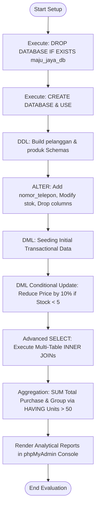

# 🤖 Relational Database Engine: College - Short Semester Classes (SP) Management System

This repository contains a collection of clean, optimized SQL scripts designed to handle data modeling, constraint validation, and business intelligence reporting. Built as the primary evaluation for the **Basis Data (3 SKS)** course, this project showcases foundational and advanced database paradigms implemented on MySQL/MariaDB engines via the XAMPP stack.

---

## 📌 Project Overview & Features

- **Robust DDL Schema Design:** Implements clean structural setup with defensive programming techniques (`DROP DATABASE IF EXISTS`), absolute integrity using Auto-Incrementing Primary Keys, and Unique constraints.
- **Relational Integrity (Foreign Keys):** Establishes explicit transactional relationships between tables using `FOREIGN KEY` constraints cascading operations (`ON DELETE CASCADE`) to prevent orphaned data records.
- **Strategic Data Manipulation (DML):** Handles complex bulk data updates, condition-based modifications (e.g., implementing 10% promo discounts for low-stock inventory), and requested data purging.
- **Advanced Business Intelligence Reporting:** Generates performance metrics utilizing complex multi-table `INNER JOIN` operations, aggregate calculations (`SUM`, `COUNT`), and advanced filtering pipelines (`GROUP BY`, `HAVING`, `ORDER BY`).

---

## 🛠️ Course Syllabus Coverage

1. **Data Definition Language (DDL):** `CREATE DATABASE`, `CREATE TABLE` with specialized column properties (`VARCHAR`, `DECIMAL`, `DATE`), `ALTER TABLE` modifications (`ADD`, `MODIFY`, `DROP COLUMN`), and database drops.
2. **Data Manipulation Language (DML):** Populating tables with multi-row transactional values (`INSERT INTO`), target-specific updates (`UPDATE ... SET ... WHERE`), and relational object deletions (`DELETE FROM`).
3. **Advanced Selection Pipelines:** Extracting context-aware criteria data using precise date ranges and conditions (`BETWEEN`, `WHERE`).
4. **Relational Table Unions:** Joining data tables structurally across logical operational channels (`INNER JOIN`, `LEFT JOIN`).
5. **Data Aggregation & Group Filtering:** Grouping non-aggregated records and filtering computational analytical outcomes using the `HAVING` statement instead of traditional filters.

---

## 📊 Program Flowchart (Database Lifecycle)



---

## 🚀 How to Run Locally

### Prerequisites

Make sure you have XAMPP Control Panel (containing Apache and MySQL Server services) installed on your local computer.

### Execution Steps

1. Clone this repository:
    ```
   git clone [https://github.com/abdullohmmuttaqin/short-semester-classes-basis_data.git](https://github.com/abdullohmmuttaqin/short-semester-classes-basis_data.git)
   ```

2. Open XAMPP Control Panel and click Start on both Apache and MySQL services.

3. Launch your favorite web browser and navigate to the database management dashboard:
    ```
    http://localhost/phpmyadmin
    ```

4. Run the executable file:
- Option A (Manual Copy): Open the 01_ddl_dml_maju_berkah.sql file in VS Code, copy all the SQL queries, navigate to the SQL tab in phpMyAdmin, paste the syntax, and click Go.

- Option B (Import Feature): Click the Import tab on the phpMyAdmin dashboard top panel, choose the file from your local cloned repository directory, and click Import/Go.

## 📑 Course & Student Information

| Field | Details |
| :--- | :--- |
| **Course** | Basis Data |
| **Lecturer** | Tri Anggoro, M.Kom. |
| **Student Name** | Abdullah Muhammad Muttaqim |
| **Student ID (NIM)** | 22EO10034 |
| **Class/Semester** | Informatika 8 B / Semester Pendek TA 2025/2026 |
| **Major/Faculty** | Fakultas Matematika dan Ilmu Komputer (FMIKOM) |
| **Institution** | Universitas Nahdlatul Ulama Al Ghazali Cilacap (UNUGHA) |

_Disclaimer: Repositori ini dibangun dengan dedikasi tinggi, kerja keras, dan pasokan kafein konstan di malam hari demi menjamin masa depan nilai Semester Pendek yang se-stabil dan se-konsisten ACID property pada database system._